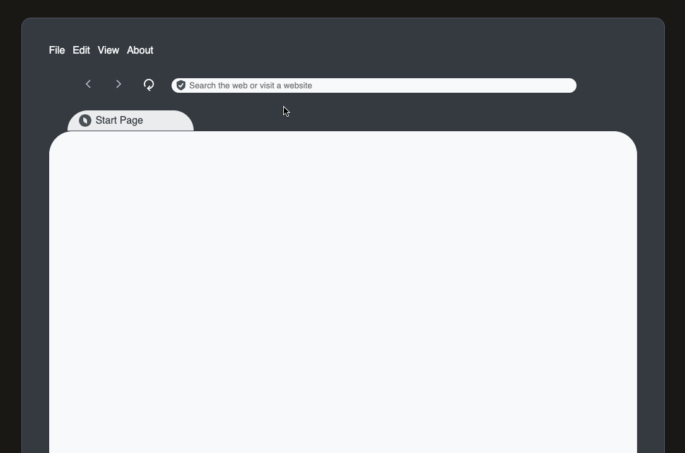

<div align="center">
    <picture>
      
    </picture>
      <div align="center">
         <h3>pyBrowser</h3>
         <p>Slither through the web.</p>
         <p>A team project brought to you by the Phenomenal Philodendrons for the 2025 Python Discord Code Jam.</p>
      </div>
</div>

## About
A web browser inside a web browser made with PyScript and FastAPI. Its absurd isn't it? It's absolutely the wrong tool for the job: it's even in Python. Let's ignore those websites that let you use a virtual web browser as per virtual machines on the web, no we don't need to remember those.

## Features
* Search with Mojeek right from the address bar
* Go back and forth to visited pages
* Sleek and Modern UI
* Page reload
* Cookies!

## Demo

### Visiting a Website
Type a website into the address bar and hit enter. All `http://` links are automatically changed to `https://`. Insecure `http` browsing isn’t supported when using `aiohttp`.



### Searching Using the Address Bar
Searching can also be performed through the address bar, do note because of a bug enter has to be pressed twice to display the HTML.


### Traversing Browser History
Going forward and backward from your recent and visited web page is done in a breeze. However, in the preview below visiting YouTube was a mistake since it made everything sluggish. The backward/forward icons remain grayed out: there were issues where changing SVG color at the time was not working in PyScript.

There was a list for storing the browser history and UI completely designed/coded in HTML/CSS but needed to be implemented using PyScript but alas it was too late.


### Reloading a Website
Does what it says in the title, may not look like it but the page was re-fetched in the backend api. Why my text highlighting didn't disappear after reloading is a bug that was just discovered.


### Cookies UI, Rendering HTML/CSS, and Other Issues
We ran out of time and did not have enough hands available to create a menu for editing cookies, viewing cookies, searching through cookies, or filtering per domain name. The HTML parser was *mostly* complete: we needed to use Canvas to paint the elements onto the page. After one of our own suffered from burn out, it was difficult to find someone who understood the code left over to finish the Canvas painting portion which occured dangerously close to the deadline and would have been helpful with the CSS parser implemented. The CSS parser remained incomplete and one of our teammates&mdash;who coded it on a fork&mdash;went mia one day before the end of Code Jam, so it was never integrated into the main repository.

## Installation
Our project relies on the `uv` Python package and project manager.
```
pip install uv
```
After installing `uv`, packages should get synced with the virtual environment.
```
uv sync
```
Now, you should be able to run the project.
```
uv run main.py
```

A server is spawned with the following address:
```
http://127.0.0.1:8000
```


## Contributions
- <a href="https://github.com/xing216">Xing</a> implemented/integrated the HTML parser, helped with documentation, and coded the Canvas rendering API
- <a href="https://github.com/Gimpy3887">Gimpy</a> implemented the frontend, backend api, wrote the documentation, and managed the repo
- <a href="https://github.com/bast0006">Cat(cat.cat())</a> created/integrated the cookies feature
- <a href="https://github.com/cameronabel">Cameron</a> created the CSS parser
- <a href="https://github.com/poti1">timka7060</a> (Team Lead) had minor contributions to a different version of the CSS parser and minor repo management


## Attribution
Free resources used to make the pyBrowser logo and its user interface as the per their license agreement we are required to attribute their creators.  

<a href="https://www.flaticon.com/free-icons/pacific" title="pacific icons">Pacific icons created by Kalashnyk - Flaticon</a>  
<a href="https://www.flaticon.com/free-icons/snake" title="snake icons">Snake icons created by Vitaly Gorbachev - Flaticon</a>  
<a href="https://www.figma.com/community/file/1159604531253325245" title="ui icons">Icon pack | 1600+ icons | 160 free icons created by HI.icons - Figma</a>
